# Generate Command Sequence Diagram

**Command:** `sdgen generate -t template.prompt.yaml`

**Last Updated:** 2025-10-22

## Overview

This document provides a detailed sequence diagram of the `generate` command execution flow, from CLI invocation to final image generation and manifest creation.

---

## Sequence Diagram

```mermaid
sequenceDiagram
    autonumber

    actor User
    participant CLI as cli.py<br/>(Typer)
    participant Config as GlobalConfig
    participant Pipeline as V2Pipeline<br/>(Orchestrator)
    participant Loader as YamlLoader
    participant Parser as ConfigParser
    participant Validator as ConfigValidator
    participant InhResolver as InheritanceResolver
    participant ImpResolver as ImportResolver
    participant TplResolver as TemplateResolver
    participant Generator as PromptGenerator
    participant Normalizer as PromptNormalizer
    participant APIClient as SDAPIClient
    participant SessionMgr as SessionManager
    participant ImgWriter as ImageWriter
    participant BatchGen as BatchGenerator
    participant ProgressRep as ProgressReporter
    participant AnnotWorker as AnnotationWorker<br/>(optional)
    participant SDAPI as SD WebUI API

    %% Phase 1: Initialization
    rect rgb(230, 240, 255)
        Note over User,CLI: Phase 1: CLI Initialization
        User->>CLI: sdgen generate -t template.yaml
        CLI->>Config: load_global_config()
        Config-->>CLI: GlobalConfig(configs_dir, output_dir, api_url)
    end

    %% Phase 2: Template Loading & Validation
    rect rgb(255, 240, 230)
        Note over CLI,Validator: Phase 2: Template Loading & Validation
        CLI->>Pipeline: V2Pipeline(configs_dir)
        Pipeline->>Pipeline: Initialize components<br/>(Loader, Parser, Validator, Resolvers)

        CLI->>Pipeline: load(template_path)
        Pipeline->>Loader: load_file(template.yaml)
        Loader->>Loader: Read YAML file
        Loader-->>Pipeline: raw_data (dict)

        Pipeline->>Parser: parse_prompt(raw_data)
        Parser->>Parser: Parse YAML structure<br/>Extract version, name, generation, etc.
        Parser->>Parser: Parse parameters.adetailer<br/>(if present)
        Parser->>Parser: Parse parameters.controlnet<br/>(if present)
        Parser-->>Pipeline: PromptConfig

        Pipeline->>Validator: validate(config)
        Validator->>Validator: Check required fields<br/>Check implements: exists<br/>Check generation config
        Validator-->>Pipeline: ValidationResult(is_valid=True)

        Pipeline-->>CLI: PromptConfig
    end

    %% Phase 3: Inheritance Resolution
    rect rgb(240, 255, 240)
        Note over CLI,InhResolver: Phase 3: Inheritance & Import Resolution
        CLI->>Pipeline: resolve(config)

        Pipeline->>InhResolver: resolve_implements(config)
        InhResolver->>InhResolver: Traverse implements: chain<br/>(prompt → template → base)
        loop For each parent
            InhResolver->>Loader: load_file(parent.yaml)
            Loader-->>InhResolver: parent_data
            InhResolver->>Parser: parse_template(parent_data)
            Parser-->>InhResolver: TemplateConfig
        end
        InhResolver->>InhResolver: Merge chain:<br/>- Template (bottom-up)<br/>- Negative prompt (bottom-up)<br/>- Parameters (top-down)<br/>- Imports (merge all)
        InhResolver-->>Pipeline: PromptConfig<br/>(with template field)

        Pipeline->>ImpResolver: resolve_imports(config)
        loop For each import
            alt Import is .yaml file
                ImpResolver->>Loader: load_file(import.yaml)
                Loader-->>ImpResolver: variations_dict
            else Import is .adetailer.yaml
                ImpResolver->>Parser: parse_adetailer_file(import)
                Parser-->>ImpResolver: ADetailerConfig
            else Import is .controlnet.yaml
                ImpResolver->>Parser: parse_controlnet_file(import)
                Parser-->>ImpResolver: ControlNetConfig
            else Import is inline string
                ImpResolver->>ImpResolver: Use string directly
            end
        end
        ImpResolver-->>Pipeline: resolved_imports (dict)

        Pipeline->>Pipeline: Merge parameters from chain
        Pipeline->>Pipeline: Build ResolvedContext<br/>(imports, chunks, parameters)
        Pipeline-->>CLI: (resolved_config, context)
    end

    %% Phase 4: Template Resolution & Prompt Generation
    rect rgb(255, 255, 230)
        Note over CLI,Normalizer: Phase 4: Template Resolution & Generation
        CLI->>Pipeline: generate(resolved_config, context)

        Pipeline->>TplResolver: resolve_template(template_str, context)
        TplResolver->>TplResolver: Phase 1: Inject chunks (@ChunkName)<br/>Structural injection (no placeholder resolution)
        loop For each @Chunk
            TplResolver->>TplResolver: Replace @Chunk with chunk.template
        end
        TplResolver-->>Pipeline: template_with_chunks

        Pipeline->>Generator: generate_prompts(resolved_config, context)
        Generator->>Generator: Extract placeholders {PlaceholderName}
        Generator->>Generator: Apply selectors ([random:N], [limit:N], etc.)

        alt Generation mode: combinatorial
            Generator->>Generator: Generate all combinations<br/>(Cartesian product)
        else Generation mode: random
            Generator->>Generator: Generate random samples<br/>(unique combinations)
        end

        loop For each combination
            Generator->>TplResolver: resolve_with_variations(template, variations)
            TplResolver->>TplResolver: Replace {Placeholder} with value
            TplResolver-->>Generator: resolved_template

            Generator->>Normalizer: normalize(resolved_template)
            Normalizer->>Normalizer: - Remove extra whitespace<br/>- Remove empty lines<br/>- Collapse consecutive commas<br/>- Fix punctuation
            Normalizer-->>Generator: normalized_prompt

            Generator->>Generator: Assign seed (fixed/progressive/random)
        end

        Generator-->>Pipeline: List[prompt_dict]<br/>(prompt, negative, seed, variations, parameters)
        Pipeline-->>CLI: prompts
    end

    %% Phase 5: Statistics & Session Setup
    rect rgb(240, 230, 255)
        Note over CLI,SessionMgr: Phase 5: Statistics & Session Setup
        CLI->>Pipeline: get_variation_statistics(template, context)
        Pipeline->>Pipeline: Count placeholders<br/>Calculate total combinations<br/>Detect multi-source imports
        Pipeline-->>CLI: stats_dict

        CLI->>CLI: Display variation statistics panel<br/>(placeholders, combinations, mode)

        CLI->>CLI: Determine session_name<br/>Priority: CLI override > config.output > config.name

        CLI->>SessionMgr: SessionManager(output_dir, session_name, dry_run)
        SessionMgr->>SessionMgr: Build output path:<br/>output_dir/YYYYMMDD_HHMMSS_session_name
        SessionMgr-->>CLI: SessionManager

        CLI->>ImgWriter: ImageWriter(session_output_dir)
        CLI->>ProgressRep: ProgressReporter(total_images, output_dir)
    end

    %% Phase 6: API Connection & Manifest Init
    rect rgb(255, 240, 255)
        Note over CLI,SDAPI: Phase 6: API Connection & Manifest
        CLI->>APIClient: SDAPIClient(api_url)
        APIClient-->>CLI: SDAPIClient

        alt Not dry-run mode
            CLI->>APIClient: test_connection()
            APIClient->>SDAPI: GET /sdapi/v1/sd-models
            SDAPI-->>APIClient: models_list
            APIClient-->>CLI: connection_ok

            CLI->>APIClient: get_model_checkpoint()
            APIClient->>SDAPI: GET /sdapi/v1/options
            SDAPI-->>APIClient: options_dict
            APIClient-->>CLI: sd_model_checkpoint
        end

        CLI->>CLI: Build variations_map:<br/>- available: all from imports<br/>- used: from generated prompts<br/>- count: total available

        CLI->>CLI: Create manifest snapshot:<br/>- version: "2.0"<br/>- timestamp<br/>- runtime_info (checkpoint)<br/>- resolved_template<br/>- generation_params<br/>- api_params (ADetailer, ControlNet)<br/>- variations

        CLI->>SessionMgr: create_session_dir()
        SessionMgr->>SessionMgr: mkdir -p session_dir

        CLI->>CLI: Write manifest.json<br/>(snapshot + empty images array)
    end

    %% Phase 7: Annotation Worker (optional)
    rect rgb(230, 255, 255)
        Note over CLI,AnnotWorker: Phase 7: Annotation Worker (optional)
        alt Annotations enabled
            CLI->>AnnotWorker: create_annotation_worker(config)
            AnnotWorker->>AnnotWorker: Start background thread<br/>(queue for images)
            AnnotWorker-->>CLI: AnnotationWorker
        end
    end

    %% Phase 8: Batch Generation
    rect rgb(255, 230, 230)
        Note over CLI,SDAPI: Phase 8: Image Generation Loop
        CLI->>BatchGen: BatchGenerator(api_client, session_mgr, writer, reporter)

        CLI->>CLI: Convert prompts to PromptConfig list<br/>(resolve ControlNet image paths)

        CLI->>BatchGen: generate_batch(prompt_configs, update_manifest_callback)

        loop For each prompt (idx, prompt_config)
            BatchGen->>ProgressRep: report_start(idx, prompt_config)
            ProgressRep->>ProgressRep: Display progress bar<br/>(image N/total)

            BatchGen->>APIClient: generate_image(prompt_config)
            APIClient->>APIClient: build_payload(prompt_config)
            APIClient->>APIClient: Inject ADetailer<br/>(if parameters.adetailer)
            APIClient->>APIClient: Inject ControlNet<br/>(if parameters.controlnet)
            APIClient->>APIClient: Encode ControlNet images<br/>(base64)
            APIClient->>SDAPI: POST /sdapi/v1/txt2img<br/>(payload with alwayson_scripts)
            SDAPI-->>APIClient: response (images, info)
            APIClient-->>BatchGen: (images, response)

            alt Success
                BatchGen->>ImgWriter: write_image(image_data, filename)
                ImgWriter->>ImgWriter: Write PNG to disk
                ImgWriter-->>BatchGen: image_path

                BatchGen->>CLI: update_manifest_callback(idx, prompt_cfg, True, response)
                CLI->>CLI: Extract real seed from response.info
                CLI->>CLI: Read manifest.json
                CLI->>CLI: Append image entry:<br/>- filename<br/>- variations<br/>- parameters (ADetailer, ControlNet)<br/>- seed (real from API)
                CLI->>CLI: Write updated manifest.json

                alt Annotations enabled
                    BatchGen->>AnnotWorker: enqueue_image(image_path, variations)
                    AnnotWorker->>AnnotWorker: Queue image for annotation
                    Note over AnnotWorker: Background thread annotates<br/>images asynchronously
                end

                BatchGen->>ProgressRep: report_success(idx, image_path)
            else Failure
                BatchGen->>ProgressRep: report_failure(idx, error)
            end
        end

        BatchGen-->>CLI: generation_complete
    end

    %% Phase 9: Cleanup
    rect rgb(240, 255, 230)
        Note over CLI,AnnotWorker: Phase 9: Cleanup & Final Report
        alt Annotations enabled
            CLI->>AnnotWorker: stop(timeout=30)
            AnnotWorker->>AnnotWorker: Wait for pending annotations
            AnnotWorker->>AnnotWorker: Shutdown thread
            AnnotWorker-->>CLI: stopped
        end

        CLI->>ProgressRep: display_final_summary()
        ProgressRep->>ProgressRep: Show success/failure counts<br/>Total time<br/>Output directory

        CLI-->>User: ✓ Generation complete
    end
```



---

## Phase Breakdown

### Phase 1: CLI Initialization
**Lines:** 1-3

- User invokes `sdgen generate -t template.yaml`
- CLI loads global config (`sdgen_config.json`)
- Retrieves `configs_dir`, `output_dir`, `api_url`

**Key Files:**
- `cli.py:122-148` (_generate function)
- `config/global_config.py` (load_global_config)

---

### Phase 2: Template Loading & Validation
**Lines:** 4-13

**Steps:**
1. Initialize V2Pipeline with all components
2. Load YAML file (YamlLoader)
3. Parse into PromptConfig (ConfigParser)
4. Parse extension configs (ADetailer, ControlNet)
5. Validate structure (ConfigValidator)

**Key Files:**
- `templating/orchestrator.py:81-113` (V2Pipeline.load)
- `templating/loaders/yaml_loader.py`
- `templating/loaders/parser.py:36-232` (parse_prompt, parse_adetailer, parse_controlnet)
- `templating/validators/validator.py`

**Validation Checks:**
- Required fields present (version, name, generation)
- `implements:` target exists (if specified)
- Generation config valid (mode, seed, seed_mode)

---

### Phase 3: Inheritance & Import Resolution
**Lines:** 14-31

**Steps:**
1. Traverse `implements:` chain (prompt → template → base)
2. Load each parent file
3. Merge chain (templates bottom-up, parameters top-down)
4. Resolve `imports:` declarations
   - `.yaml` files → variations dict
   - `.adetailer.yaml` → ADetailerConfig
   - `.controlnet.yaml` → ControlNetConfig
   - Inline strings → direct use
5. Build ResolvedContext

**Key Files:**
- `templating/resolvers/inheritance_resolver.py` (resolve_implements)
- `templating/resolvers/import_resolver.py` (resolve_imports)
- `templating/loaders/parser.py` (parse_adetailer_file, parse_controlnet_file)

**Merge Strategy:**
- **Template:** Child wraps parent (bottom-up)
- **Negative prompt:** Concatenate (bottom-up)
- **Parameters:** Child overrides parent (top-down priority)
- **Imports:** Merge all (child overrides on conflict)

---

### Phase 4: Template Resolution & Generation
**Lines:** 32-52

**Steps:**
1. **Phase 1 Chunk Injection:** Replace `@ChunkName` with chunk.template (structural)
2. **Extract Placeholders:** Find all `{PlaceholderName}` in template
3. **Apply Selectors:** `[random:N]`, `[limit:N]`, `[indexes:1,5]`, `[keys:foo,bar]`
4. **Generate Combinations:**
   - **Combinatorial:** All combinations (Cartesian product)
   - **Random:** Random unique samples
5. **For Each Combination:**
   - Replace `{Placeholder}` with actual value
   - Normalize prompt (whitespace, punctuation)
   - Assign seed (fixed/progressive/random)

**Key Files:**
- `templating/resolvers/template_resolver.py` (resolve_template, resolve_with_variations)
- `templating/generators/generator.py` (generate_prompts)
- `templating/normalizers/normalizer.py` (normalize)

**Normalization Rules:**
- Remove leading/trailing whitespace per line
- Remove empty lines
- Collapse consecutive commas (`, , ,` → `,`)
- Fix punctuation spacing

---

### Phase 5: Statistics & Session Setup
**Lines:** 53-61

**Steps:**
1. Calculate variation statistics
   - Total placeholders
   - Variations per placeholder
   - Total combinations
   - Multi-source detection
2. Display statistics panel
3. Determine session name (priority: CLI > config.output > config.name)
4. Initialize SessionManager (creates timestamped output dir)
5. Initialize ImageWriter and ProgressReporter

**Key Files:**
- `templating/orchestrator.py` (get_variation_statistics)
- `api/session_manager.py`
- `api/image_writer.py`
- `api/progress_reporter.py`

**Session Name Priority:**
1. CLI `--session-name` flag (highest)
2. `config.output.session_name` (YAML)
3. `config.name` (YAML)
4. Template filename (fallback)

**Output Directory Format:**
```
{output_dir}/YYYYMMDD_HHMMSS_{session_name}/
```

---

### Phase 6: API Connection & Manifest Init
**Lines:** 62-76

**Steps:**
1. Initialize SDAPIClient
2. Test API connection (GET /sdapi/v1/sd-models)
3. Fetch current checkpoint (GET /sdapi/v1/options)
4. Build variations_map
   - `available`: All variations from imports
   - `used`: Variations in generated prompts
   - `count`: Total available
5. Create manifest snapshot
6. Write initial manifest.json (snapshot + empty images array)

**Key Files:**
- `api/sdapi_client.py`
- `cli.py:255-366` (manifest creation)

**Manifest Structure:**
```json
{
  "snapshot": {
    "version": "2.0",
    "timestamp": "2025-10-22T10:30:00",
    "runtime_info": {
      "sd_model_checkpoint": "model.safetensors"
    },
    "resolved_template": {
      "prompt": "...",
      "negative": "..."
    },
    "generation_params": {
      "mode": "random",
      "seed_mode": "progressive",
      "base_seed": 42,
      "num_images": 50,
      "total_combinations": 1000
    },
    "api_params": {
      "sampler_name": "DPM++ 2M Karras",
      "steps": 30,
      "adetailer": {...},
      "controlnet": {...}
    },
    "variations": {
      "Expression": {
        "available": ["happy", "sad", ...],
        "used": ["happy", "sad"],
        "count": 10
      }
    }
  },
  "images": []
}
```

---

### Phase 7: Annotation Worker (Optional)
**Lines:** 77-82

**Steps:**
1. Check if annotations enabled (`config.output.annotations.enabled`)
2. Create AnnotationWorker (background thread)
3. Worker waits for images in queue

**Key Files:**
- `api/annotation_worker.py`

**Annotation Features:**
- Real-time annotations (during generation)
- Configurable position (top-left, bottom-right, etc.)
- Configurable keys (which variations to show)
- Font size, colors, transparency

---

### Phase 8: Image Generation Loop
**Lines:** 83-116

**Steps:**
1. Convert prompts to PromptConfig list
2. Resolve ControlNet image paths (relative → absolute)
3. **For Each Prompt:**
   - Build API payload
   - Inject ADetailer (if present) → `alwayson_scripts.ADetailer`
   - Inject ControlNet (if present) → `alwayson_scripts.controlnet`
   - Encode ControlNet images (base64)
   - POST /sdapi/v1/txt2img
   - Write image to disk
   - Update manifest incrementally (append image entry)
   - Enqueue for annotation (if enabled)
   - Report progress

**Key Files:**
- `api/batch_generator.py` (generate_batch)
- `api/sdapi_client.py` (generate_image, build_payload)
- `api/image_writer.py` (write_image)
- `cli.py:482-544` (update_manifest_callback)

**API Payload Structure:**
```json
{
  "prompt": "...",
  "negative_prompt": "...",
  "seed": 42,
  "steps": 30,
  "cfg_scale": 7.0,
  "width": 768,
  "height": 512,
  "sampler_name": "DPM++ 2M Karras",
  "alwayson_scripts": {
    "ADetailer": {
      "args": [true, false, "face_yolov9c.pt", ...]
    },
    "controlnet": {
      "args": [
        {
          "enabled": true,
          "model": "control_v11p_sd15_canny",
          "image": "data:image/png;base64,iVBOR...",
          ...
        }
      ]
    }
  }
}
```

**Manifest Update (Per Image):**
```json
{
  "images": [
    {
      "filename": "session_0001.png",
      "variations": {
        "Expression": "happy",
        "Angle": "front"
      },
      "parameters": {
        "sampler_name": "DPM++ 2M Karras",
        "steps": 30,
        "adetailer": {...},
        "controlnet": {...}
      },
      "seed": 42
    }
  ]
}
```

---

### Phase 9: Cleanup & Final Report
**Lines:** 117-127

**Steps:**
1. Stop annotation worker (wait for pending, max 30s)
2. Display final summary
   - Success count / Failure count
   - Total time
   - Output directory

**Key Files:**
- `api/annotation_worker.py` (stop)
- `api/progress_reporter.py` (display_final_summary)

---

## Key Data Structures

### PromptConfig
```python
@dataclass
class PromptConfig:
    version: str
    name: str
    generation: GenerationConfig
    prompt: str
    source_file: Path
    implements: Optional[str] = None
    imports: Dict[str, Any] = field(default_factory=dict)
    parameters: Dict[str, Any] = field(default_factory=dict)
    negative_prompt: Optional[str] = None
    output: Optional[OutputConfig] = None
    template: Optional[str] = None  # Populated during resolution
```

### ResolvedContext
```python
@dataclass
class ResolvedContext:
    imports: Dict[str, Dict[str, str]]  # {import_name: {key: value}}
    chunks: Dict[str, ChunkConfig]      # {chunk_name: ChunkConfig}
    parameters: Dict[str, Any]
    variation_state: Dict[str, str] = field(default_factory=dict)
```

### Generated Prompt Dict
```python
{
    "prompt": "masterpiece, happy girl, detailed",
    "negative_prompt": "low quality",
    "seed": 42,
    "variations": {
        "Expression": "happy",
        "Angle": "front"
    },
    "parameters": {
        "sampler_name": "DPM++ 2M Karras",
        "steps": 30,
        "cfg_scale": 7.0,
        "width": 768,
        "height": 512,
        "adetailer": ADetailerConfig(...),
        "controlnet": ControlNetConfig(...)
    }
}
```

---

## Component Responsibilities

| Component | Responsibility |
|-----------|----------------|
| **YamlLoader** | Load YAML files, handle multi-document |
| **ConfigParser** | Parse YAML dicts into typed models |
| **ConfigValidator** | Validate structure, required fields |
| **InheritanceResolver** | Resolve `implements:` chain, merge configs |
| **ImportResolver** | Load imports (YAML, ADetailer, ControlNet, strings) |
| **TemplateResolver** | Inject chunks, resolve placeholders |
| **PromptGenerator** | Generate combinations, apply selectors |
| **PromptNormalizer** | Clean whitespace, punctuation |
| **SDAPIClient** | Communicate with SD WebUI API |
| **SessionManager** | Manage output directory |
| **ImageWriter** | Write PNG files |
| **ProgressReporter** | Display progress, statistics |
| **BatchGenerator** | Orchestrate image generation loop |
| **AnnotationWorker** | Add variation overlays (background) |

---

## Error Handling

### FileNotFoundError
- Template file not found
- Parent template not found (`implements:`)
- Import file not found

### ValueError
- Invalid YAML structure
- Missing required fields
- Validation failure
- Invalid selectors

### ConnectionError
- SD WebUI API not responding
- API connection timeout

### APIError
- Image generation failed
- Invalid API payload
- Extension not installed (ADetailer, ControlNet)

---

## Performance Considerations

### Memory
- Prompts loaded in memory (limit with `-n`)
- Images not stored in memory (written directly to disk)
- Manifest updated incrementally (no full load)

### Parallelization
- Single-threaded generation (API limitation)
- Annotation worker runs in background thread
- Manifest updates are sequential (file locking)

### Optimization
- Template resolution cached per combination
- Import files loaded once (cached)
- Chunks resolved once (structural phase)

---

## See Also

- [Template System Reference](../reference/template-system.md)
- [ADetailer Reference](../reference/adetailer.md)
- [ControlNet Reference](../reference/controlnet.md)
- [V2 Pipeline Architecture](./v2-pipeline-architecture.md)
