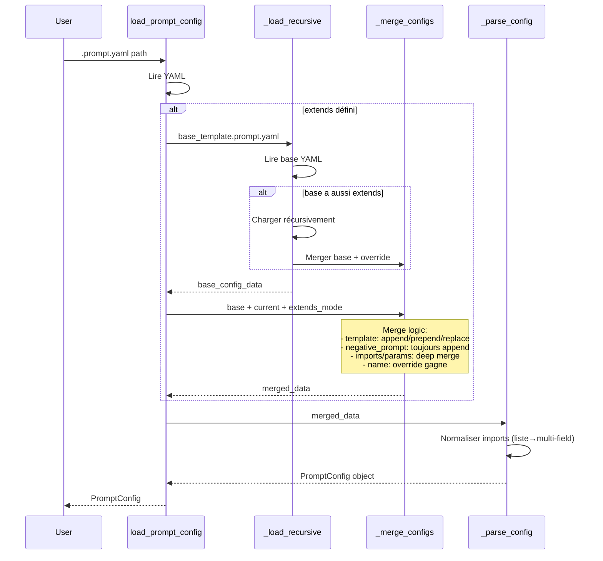
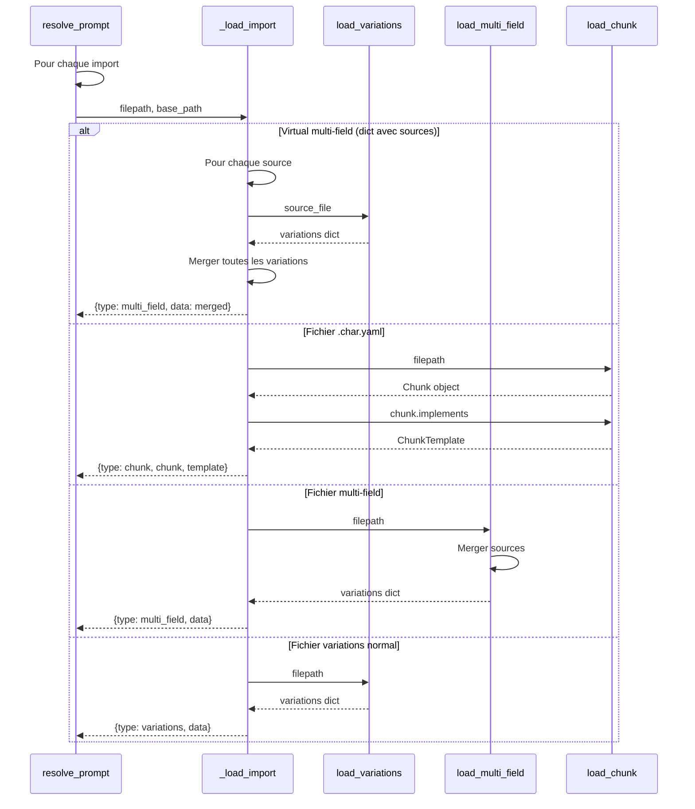
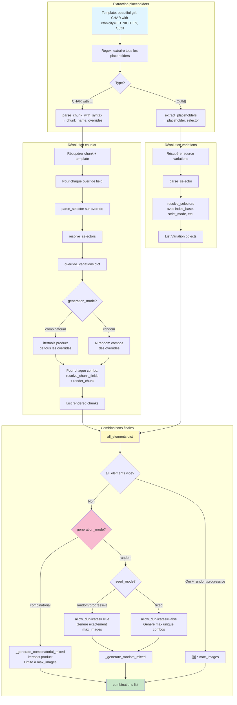

# Phase 2 Templating Engine

**Architecture et flux de données du moteur de templating YAML Phase 2**

---

## Vue d'ensemble

Le moteur de templating Phase 2 permet de créer des prompts complexes avec :
- **Variations** : fichiers YAML de variations réutilisables
- **Multi-field** : variations qui modifient plusieurs champs simultanément
- **Chunks/Characters** : templates de personnages avec champs structurés
- **Selectors** : syntaxe avancée pour sélectionner des variations
- **Héritage** : système `extends` pour éviter la duplication

---

## Architecture Mermaid

```mermaid
flowchart TD
    Start([Utilisateur charge un .prompt.yaml]) --> LoadPrompt[load_prompt_config]

    LoadPrompt --> CheckExtends{extends défini?}
    CheckExtends -->|Oui| LoadBase[Charger base template récursivement]
    CheckExtends -->|Non| ParseConfig[_parse_prompt_config]

    LoadBase --> MergeConfigs[_merge_configs<br/>Mode: append/prepend/replace]
    MergeConfigs --> ParseConfig

    ParseConfig --> NormalizeImports[Normaliser imports<br/>Liste → virtual multi-field]
    NormalizeImports --> CreateConfig[Créer PromptConfig object]

    CreateConfig --> ResolvePrompt[resolve_prompt]

    subgraph "Phase 1: Chargement des imports"
        ResolvePrompt --> LoadImports[Charger tous les imports]
        LoadImports --> CheckType{Type d'import?}

        CheckType -->|String path| LoadFile[Charger fichier YAML]
        CheckType -->|Dict/List| VirtualMulti[Virtual multi-field<br/>Merge plusieurs fichiers]

        LoadFile --> FileType{Type de fichier?}
        FileType -->|.char.yaml| LoadChunk[load_chunk +<br/>load_chunk_template]
        FileType -->|multi-field| LoadMultiField[load_multi_field_variations<br/>Merge sources]
        FileType -->|variations| LoadVariations[load_variations<br/>Parse YAML]

        VirtualMulti --> MergeSources[Merger tous les fichiers sources]
        MergeSources --> ImportsLoaded[Imports chargés]
        LoadChunk --> ImportsLoaded
        LoadMultiField --> ImportsLoaded
        LoadVariations --> ImportsLoaded
    end

    subgraph "Phase 2: Parsing du template"
        ImportsLoaded --> ExtractPlaceholders[Extraire placeholders du template]
        ExtractPlaceholders --> SplitTypes{Type de placeholder?}

        SplitTypes -->|Chunk with syntax| ParseChunk[parse_chunk_with_syntax<br/>Extraire overrides]
        SplitTypes -->|Normal variation| ParseSelector[parse_selector<br/>Extraire sélecteurs]

        ParseChunk --> ChunkPlaceholders[chunk_placeholders]
        ParseSelector --> VarPlaceholders[variation_placeholders]
    end

    subgraph "Phase 3: Résolution des chunks"
        ChunkPlaceholders --> ResolveChunks[Pour chaque chunk]
        ResolveChunks --> ResolveOverrides[Résoudre field overrides<br/>avec sélecteurs]
        ResolveOverrides --> RenderChunk[resolve_chunk_fields +<br/>render_chunk]
        RenderChunk --> ResolvedChunks[resolved_chunks<br/>Dict chunk → List rendered]
    end

    subgraph "Phase 4: Résolution des variations"
        VarPlaceholders --> ResolveVars[Pour chaque variation]
        ResolveVars --> ApplySelectors[resolve_selectors<br/>Appliquer sélecteurs]
        ApplySelectors --> ResolvedVars[resolved_variations<br/>Dict placeholder → List Variation]
    end

    subgraph "Phase 5: Génération des combinaisons"
        ResolvedChunks --> MergeElements[Merger chunks + variations<br/>dans all_elements]
        ResolvedVars --> MergeElements

        MergeElements --> CheckEmpty{all_elements vide?}
        CheckEmpty -->|Oui + random/progressive| GenEmpty[Générer N copies vides<br/>pour seeds différentes]
        CheckEmpty -->|Non| CheckMode{generation_mode?}

        CheckMode -->|combinatorial| GenCombi[_generate_combinatorial_mixed<br/>Produit cartésien]
        CheckMode -->|random| CheckDupes{seed_mode?}

        CheckDupes -->|random/progressive| GenRandomDupe[_generate_random_mixed<br/>allow_duplicates=True]
        CheckDupes -->|fixed| GenRandomUnique[_generate_random_mixed<br/>allow_duplicates=False]

        GenEmpty --> Combinations[combinations<br/>List Dict]
        GenCombi --> Combinations
        GenRandomDupe --> Combinations
        GenRandomUnique --> Combinations
    end

    subgraph "Phase 6: Génération finale"
        Combinations --> IterCombo[Pour chaque combination]
        IterCombo --> CalcSeed{seed_mode?}

        CalcSeed -->|fixed| SeedFixed[seed = config.seed]
        CalcSeed -->|progressive| SeedProg[seed = config.seed + idx]
        CalcSeed -->|random| SeedRandom[seed = -1]

        SeedFixed --> ReplaceChunks[Remplacer chunks dans template<br/>regex: CHUNK with ...]
        SeedProg --> ReplaceChunks
        SeedRandom --> ReplaceChunks

        ReplaceChunks --> ReplaceVars[Remplacer variations<br/>regex: Placeholder]
        ReplaceVars --> CreateResolved[Créer ResolvedVariation<br/>index, seed, placeholders, final_prompt]
        CreateResolved --> AddToResult[Ajouter à result]

        AddToResult --> MoreCombos{Plus de combos?}
        MoreCombos -->|Oui| IterCombo
        MoreCombos -->|Non| ReturnResult[Retourner List ResolvedVariation]
    end

    ReturnResult --> End([Prêt pour génération d'images])

    style Start fill:#e1f5ff
    style End fill:#c8e6c9
    style LoadPrompt fill:#fff9c4
    style ResolvePrompt fill:#fff9c4
    style MergeConfigs fill:#ffe0b2
    style GenCombi fill:#f8bbd0
    style GenRandomDupe fill:#f8bbd0
    style CreateResolved fill:#d1c4e9
```



---

## Flux détaillé par phase

### Phase 1: Chargement et héritage



### Phase 2: Résolution des imports



### Phase 3: Sélection et combinaisons



---

## Types de données clés

### PromptConfig
```python
@dataclass
class PromptConfig:
    name: str
    imports: Dict[str, Union[str, Dict]]  # Path ou virtual multi-field
    prompt_template: str
    negative_prompt: str
    generation_mode: str  # combinatorial | random
    seed_mode: str        # fixed | progressive | random
    seed: int
    max_images: Optional[int]
    base_path: Optional[str]  # Pour résoudre paths relatifs
    # ... paramètres SD API
```

### Variation
```python
@dataclass
class Variation:
    key: str      # "happy"
    value: str    # "smiling, cheerful"
    weight: float # 1.0
```

### MultiFieldVariation
```python
@dataclass
class MultiFieldVariation(Variation):
    fields: Dict[str, str]  # {"appearance.skin": "dark skin", ...}
```

### ResolvedVariation
```python
@dataclass
class ResolvedVariation:
    index: int                    # 0, 1, 2...
    seed: int                     # Seed calculée
    placeholders: Dict[str, str]  # {"Outfit": "red dress", ...}
    final_prompt: str             # Prompt final avec remplacements
    negative_prompt: str
```

---

## Syntaxe des sélecteurs

### Sélecteurs de base
```yaml
template: |
  {Outfit}                    # Toutes les variations
  {Outfit[random:5]}          # 5 variations aléatoires
  {Outfit[0,2,4]}             # Indices 0, 2, 4
  {Outfit[happy,sad]}         # Keys "happy" et "sad"
  {Outfit[#0-5]}              # Range d'indices 0 à 5
```

### Sélecteurs avancés (Phase 2)
```yaml
# Chunks avec overrides
{CHARACTER with ethnicity=ETHNICITIES[african,asian]}
{CHARACTER with appearance.hair=HAIRCOLORS[random:3]}

# Multi-field expansion automatique
imports:
  Ethnicity: ethnicities.yaml  # Type: multi-field

# ethnicities.yaml contient:
# type: multi_field
# variations:
#   - key: african
#     fields:
#       appearance.skin: "dark skin"
#       appearance.hair: "coily black hair"
```

---

## Modes de génération

### Mode Combinatorial
```python
# Génère toutes les combinaisons possibles
all_elements = {
    "Outfit": [var1, var2, var3],
    "Angle": [var1, var2]
}
# Résultat: 3 × 2 = 6 combinaisons

combinations = list(itertools.product(*all_elements.values()))
if max_images:
    combinations = combinations[:max_images]
```

### Mode Random (avec allow_duplicates)
```python
# Génère exactement max_images combinaisons
# Si seed_mode = random/progressive: permet les duplications
for i in range(max_images):
    combo = {
        name: random.choice(variations)
        for name, variations in all_elements.items()
    }
    combinations.append(combo)
```

### Cas spécial: Aucune variation
```python
# Template sans placeholders + seed random/progressive
if not all_elements and seed_mode in ('random', 'progressive'):
    # Générer N copies pour N seeds différentes
    combinations = [{}] * max_images
```

---

## Système d'héritage

### extends_mode: append (par défaut)
```yaml
# base.prompt.yaml
template: |
  masterpiece, {Outfit}

# child.prompt.yaml
extends: base.prompt.yaml
extends_mode: append
template: |
  smiling, looking at viewer

# Résultat:
# template = "masterpiece, {Outfit}\nsmiling, looking at viewer"
```

### extends_mode: prepend
```yaml
extends_mode: prepend
# template = "smiling, looking at viewer\nmasterpiece, {Outfit}"
```

### extends_mode: replace
```yaml
extends_mode: replace
# template = "smiling, looking at viewer"  (ignore base)
```

### Merge des autres sections
- **imports/variations**: Deep merge (override gagne en cas de conflit)
- **parameters**: Deep merge (override gagne)
- **generation**: Deep merge (override gagne)
- **negative_prompt**: Toujours append (concaténation)
- **name**: Override gagne toujours

---

## Imports: Liste de fichiers

### Ancien système (Phase 1)
```yaml
# Créer un fichier intermédiaire
# haircolor_combined.yaml
type: multi-field
sources:
  - haircolor.realist.yaml
  - haircolor.fantasy.yaml

# Puis l'importer
imports:
  HairColor: variations/haircolor_combined.yaml
```

### Nouveau système (Phase 2.1)
```yaml
# Import direct d'une liste
imports:
  HairColor:
    - haircolor.realist.yaml
    - haircolor.fantasy.yaml
```

Le loader crée automatiquement un virtual multi-field qui merge les fichiers.

---

## Exemples complets

### Exemple 1: Template minimal avec héritage
```yaml
# base_portrait.prompt.yaml
version: '2.0'
name: 'Base Portrait'
base_path: ../..

imports:
  HairColor: variations/haircolors.yaml
  Outfit: variations/outfits.yaml

template: |
  masterpiece, ultra-HD, {HairColor} hair, {Outfit}

parameters:
  width: 832
  height: 1216
  steps: 24

---

# portrait_chloé.prompt.yaml
version: '2.0'
name: 'Portrait Chloé'
extends: base_portrait.prompt.yaml

template: |
  smiling, freckles, looking at viewer

generation:
  mode: random
  seed_mode: progressive
  seed: 1000
  max_images: 50

output:
  session_name: portrait_chloe
```

### Exemple 2: Multi-file imports
```yaml
version: '2.0'
name: 'Fantasy Character'

imports:
  Expression:
    - expressions.joy.yaml
    - expressions.angry.yaml
    - expressions.surprised.yaml
  Outfit:
    - outfits.fantasy.yaml
    - outfits.cyberpunk.yaml

template: |
  {Expression}, {Outfit}, detailed artwork

generation:
  mode: random
  seed_mode: random
  max_images: 100
```

### Exemple 3: Sans variations (seeds multiples)
```yaml
version: '2.0'
name: 'Fixed Prompt Multi Seeds'

template: |
  masterpiece, beautiful landscape, sunset, mountains

generation:
  mode: random
  seed_mode: progressive
  seed: 5000
  max_images: 40

# Génère 40 images avec seeds 5000-5039
```

---

## Diagramme de flux simplifié

```mermaid
flowchart LR
    A[.prompt.yaml] --> B{extends?}
    B -->|Oui| C[Charger + merger base]
    B -->|Non| D[Parser config]
    C --> D

    D --> E[Charger imports]
    E --> F{Type import?}
    F -->|Liste| G[Virtual multi-field]
    F -->|String| H[Charger fichier]

    G --> I[Imports chargés]
    H --> I

    I --> J[Parser template]
    J --> K[Résoudre chunks]
    J --> L[Résoudre variations]

    K --> M[Générer combinaisons]
    L --> M

    M --> N{Mode?}
    N -->|combinatorial| O[Produit cartésien]
    N -->|random| P[Random avec/sans dupes]

    O --> Q[Pour chaque combo]
    P --> Q

    Q --> R[Calculer seed]
    R --> S[Remplacer placeholders]
    S --> T[ResolvedVariation]

    style A fill:#e1f5ff
    style T fill:#c8e6c9
```



---

## Références

- **[Loaders](../../../CLI/src/templating/loaders.py)** - Chargement des variations
- **[Prompt Config](../../../CLI/src/templating/prompt_config.py)** - Parsing et héritage
- **[Resolver](../../../CLI/src/templating/resolver.py)** - Résolution et combinaisons
- **[Multi-field](../../../CLI/src/templating/multi_field.py)** - Variations multi-champs
- **[Chunk](../../../CLI/src/templating/chunk.py)** - Templates de personnages

---

**Status:** Phase 2 complete avec imports list + extends ✅
**Dernière mise à jour:** 2025-10-06
