# Guide du Système de Templating YAML

**Guide utilisateur complet pour créer des prompts avec le système de templating Phase 2**

---

## Vue d'ensemble

Le système de templating YAML vous permet de créer des prompts réutilisables et modulaires pour Stable Diffusion. Au lieu d'écrire 100 prompts différents manuellement, vous définissez :
- Un **template** avec des placeholders
- Des **fichiers de variations** qui remplissent ces placeholders
- Des **modes de génération** pour créer toutes les combinaisons ou des sélections aléatoires

---

## Concepts de base illustrés

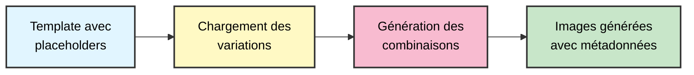

### Exemple simple

**Template**
```yaml
template: beautiful portrait, {Expression}, {Outfit}
```

**Variations**
```
expressions.yaml:
  happy: smiling, cheerful
  sad: crying, tears

outfits.yaml:
  dress: red dress
  suit: formal suit
```

**Résultat** (mode combinatorial)
```
Image 1: beautiful portrait, smiling, cheerful, red dress
Image 2: beautiful portrait, smiling, cheerful, formal suit
Image 3: beautiful portrait, crying, tears, red dress
Image 4: beautiful portrait, crying, tears, formal suit
```

---

## Structure de projet

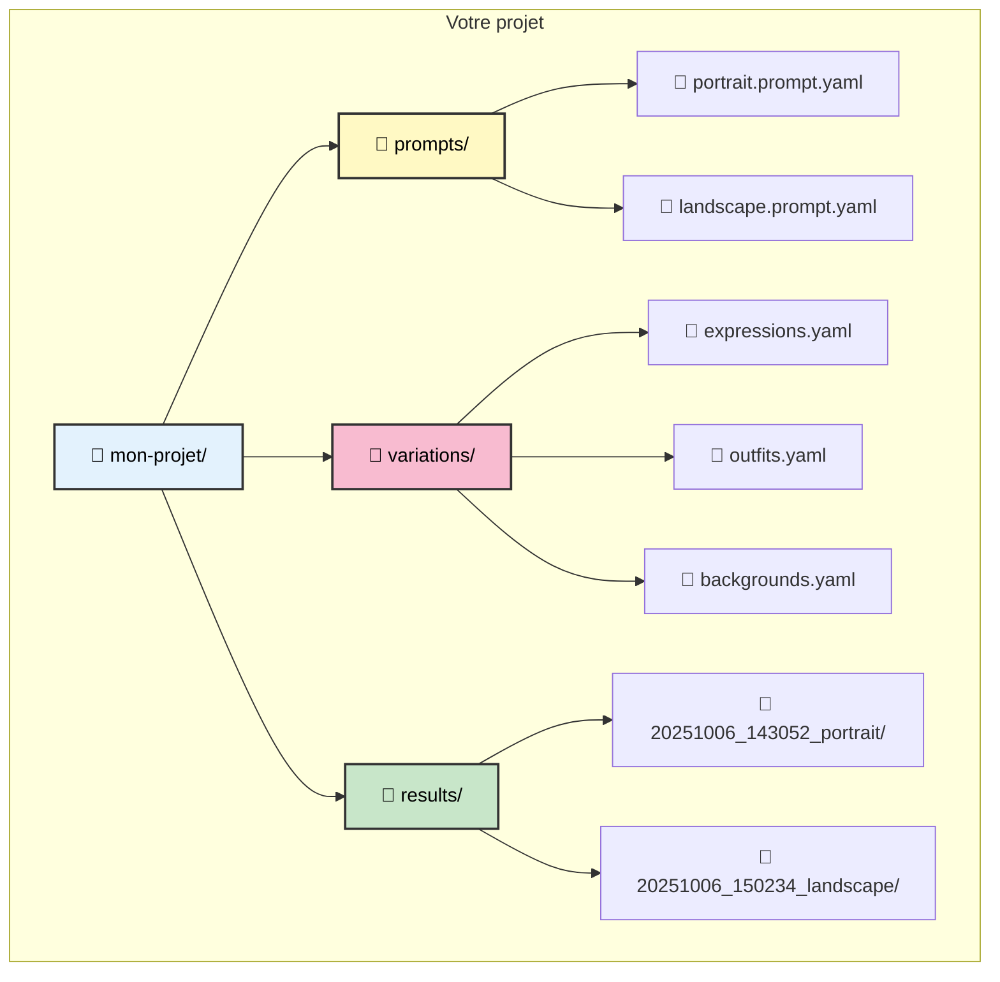

---

## Progression des concepts

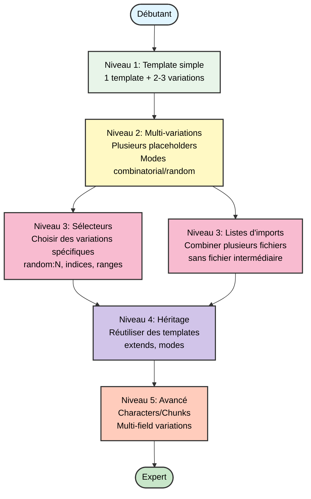

---

## Niveau 1 : Template simple

### Fichier minimal

```yaml
version: '2.0'
name: 'Mon Premier Portrait'

imports:
  Expression: ../variations/expressions.yaml

template: |
  beautiful portrait, {Expression}, detailed

generation:
  mode: combinatorial
  seed_mode: progressive
  seed: 1000
  max_images: 10

parameters:
  width: 512
  height: 768
  steps: 20
  cfg_scale: 7
  sampler: DPM++ 2M Karras
```

### Ce qui se passe

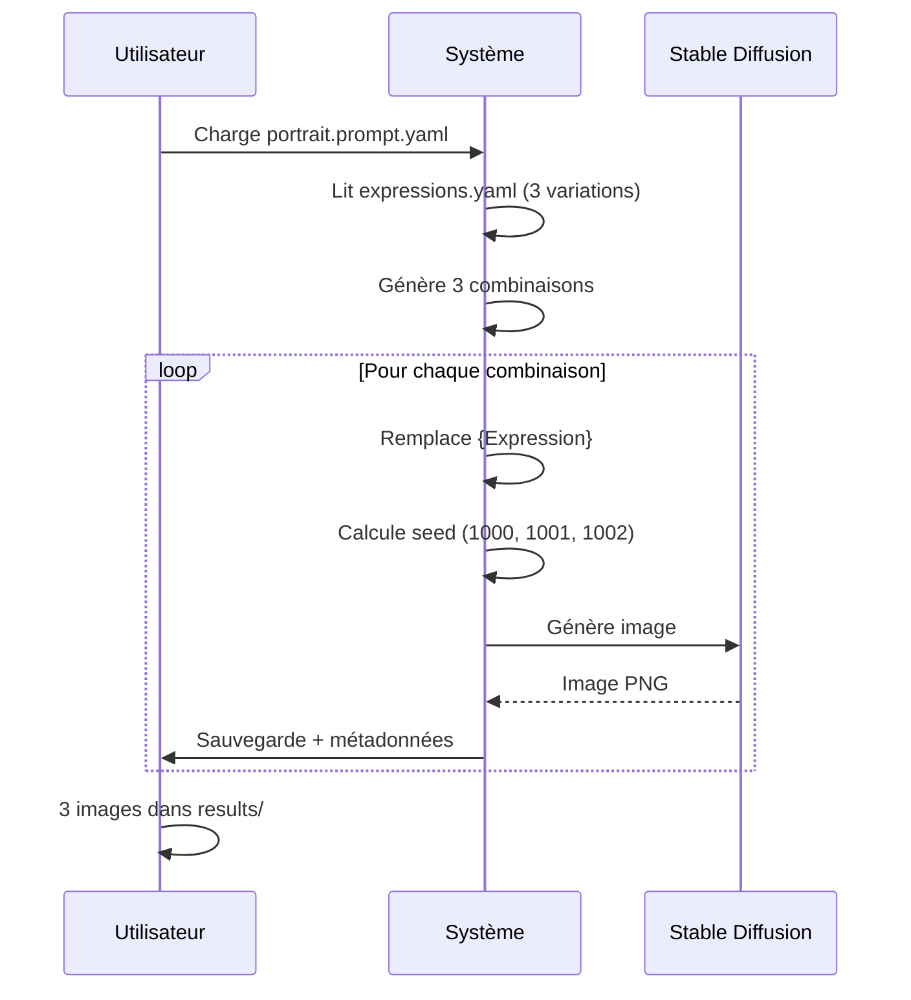

---

## Niveau 2 : Multi-variations

### Template avec plusieurs placeholders

```yaml
version: '2.0'
name: 'Portrait Complet'

imports:
  Expression: ../variations/expressions.yaml      # 5 variations
  Outfit: ../variations/outfits.yaml             # 4 variations
  Background: ../variations/backgrounds.yaml      # 3 variations

template: |
  masterpiece, beautiful woman, {Expression}, {Outfit}, {Background}

generation:
  mode: combinatorial
  max_images: 60  # 5 × 4 × 3 = 60 combinaisons
```

### Visualisation des combinaisons

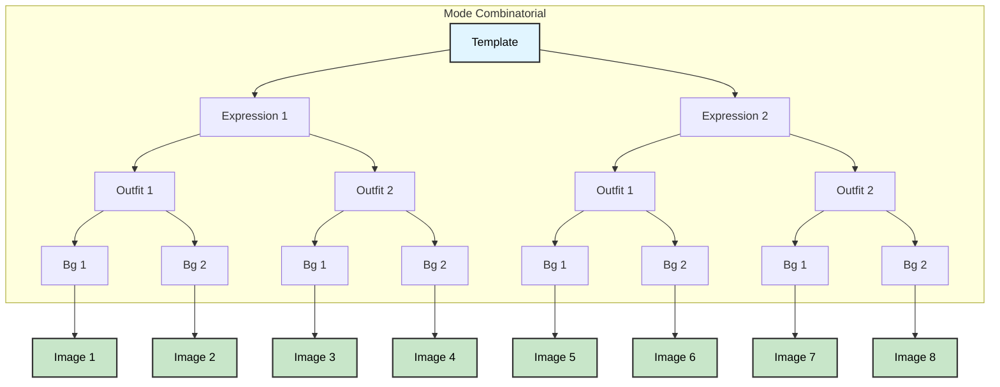

### Mode Random vs Combinatorial

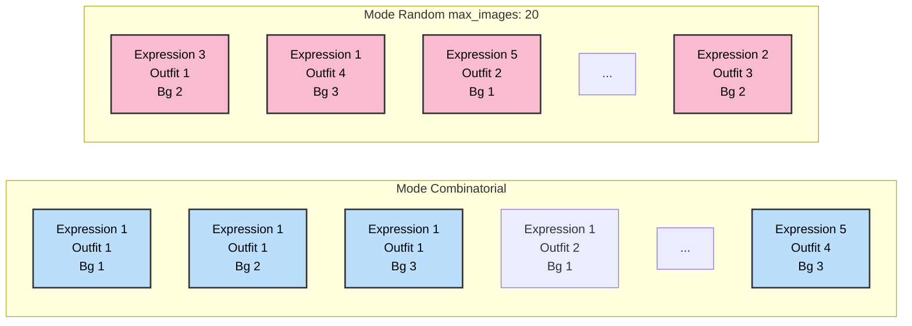

---

## Niveau 3a : Sélecteurs

### Syntaxe des sélecteurs

```yaml
template: |
  {Expression}              # Toutes les variations
  {Expression[random:5]}    # 5 variations aléatoires
  {Expression[0,2,4]}       # Indices 0, 2, 4 uniquement
  {Expression[happy,sad]}   # Variations nommées "happy" et "sad"
  {Expression[#0-10]}       # Range d'indices 0 à 10
```

### Exemple concret

```yaml
version: '2.0'
name: 'Test Expressions Spécifiques'

imports:
  Expression: ../variations/expressions.yaml  # 50 expressions disponibles
  Angle: ../variations/angles.yaml           # 20 angles disponibles

template: |
  portrait, {Expression[random:5]}, {Angle[front,side,back]}

generation:
  mode: combinatorial
  # Résultat: 5 expressions × 3 angles = 15 images
```

### Visualisation

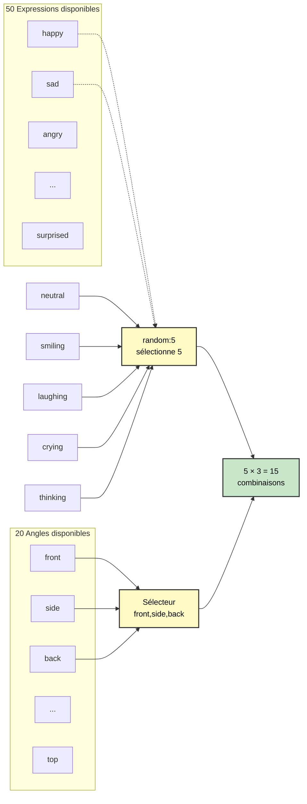

---

## Niveau 3b : Listes d'imports

### Avant (Phase 1)

```yaml
# Fallait créer un fichier intermédiaire
# haircolors_combined.yaml:
type: multi-field
sources:
  - haircolors.realist.yaml
  - haircolors.fantasy.yaml

# Puis l'importer
imports:
  HairColor: ../variations/haircolors_combined.yaml
```

### Maintenant (Phase 2)

```yaml
# Import direct d'une liste !
imports:
  HairColor:
    - ../variations/haircolors.realist.yaml
    - ../variations/haircolors.fantasy.yaml
    - ../variations/haircolors.gradient.yaml
```

### Visualisation

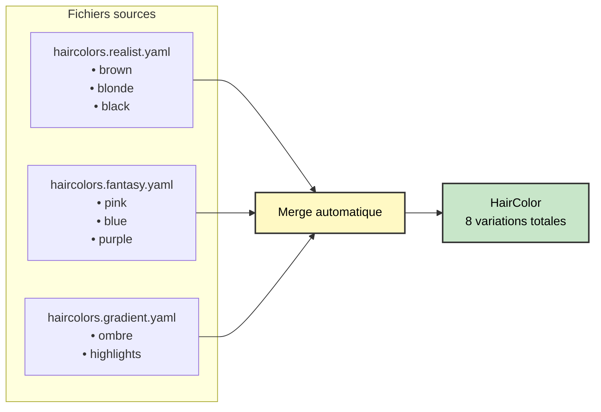

---

## Niveau 4 : Héritage de templates

### Use case typique

Vous avez un setup technique que vous aimez (résolution, steps, sampler, etc.) et vous voulez créer plusieurs prompts qui partagent cette base.

### Template de base

```yaml
# base_portrait.prompt.yaml
version: '2.0'
name: 'Base Portrait Setup'
base_path: ../..

imports:
  HairColor: variations/haircolors.yaml
  Outfit: variations/outfits.yaml

template: |
  masterpiece, ultra-HD, high detail, depth of field,
  beautiful woman, {HairColor} hair, {Outfit},
  cinematic lighting, HDR

parameters:
  width: 832
  height: 1216
  steps: 24
  cfg_scale: 3
  sampler: DPM++ 2M Karras
  enable_hr: true
  hr_scale: 1.5
  hr_upscaler: 4x_foolhardy_Remacri
  denoising_strength: 0.4
```

### Templates enfants

```yaml
# portrait_smiling.prompt.yaml
version: '2.0'
name: 'Portrait Souriant'
extends: base_portrait.prompt.yaml
extends_mode: append

template: |
  smiling, happy, looking at viewer

generation:
  mode: random
  seed_mode: progressive
  seed: 1000
  max_images: 50

output:
  session_name: portrait_happy
```

```yaml
# portrait_action.prompt.yaml
version: '2.0'
name: 'Portrait Action'
extends: base_portrait.prompt.yaml
extends_mode: append

template: |
  dynamic pose, action shot, motion blur

imports:
  Action: variations/actions.yaml

generation:
  mode: combinatorial
  max_images: 100

output:
  session_name: portrait_action
```

### Visualisation de l'héritage

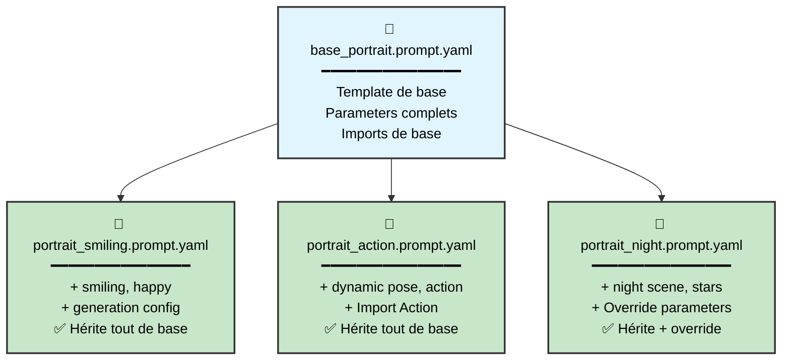

### Modes d'extension

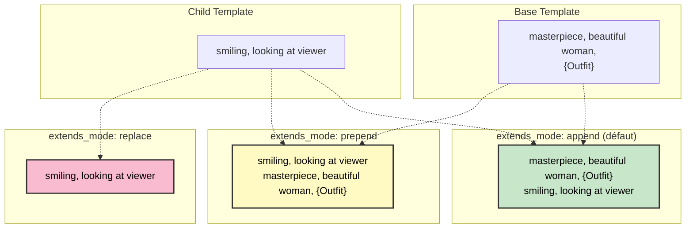

---

## Modes de seed

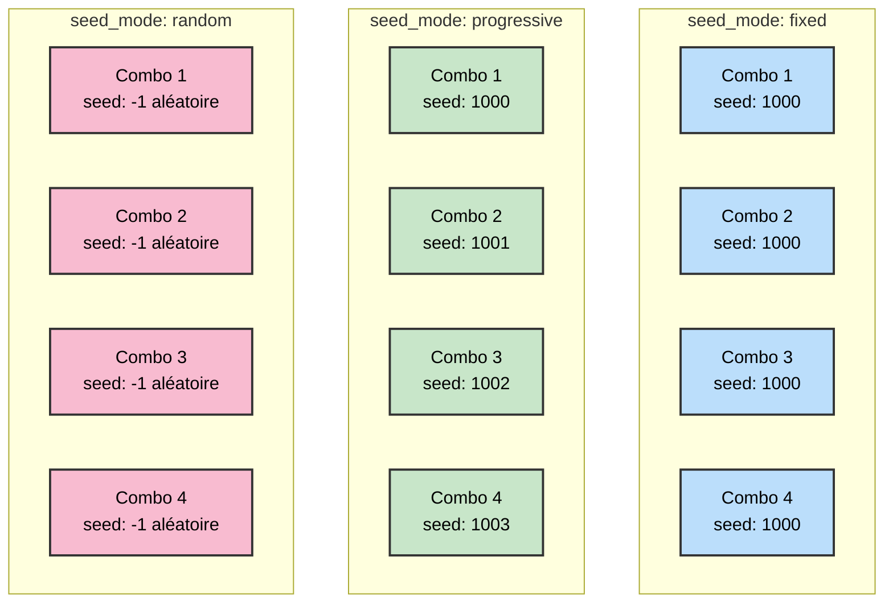

### Cas spécial : Génération sans variations

```yaml
version: '2.0'
name: 'Même prompt, seeds différentes'

# Aucun import !

template: |
  masterpiece, beautiful sunset landscape, mountains, lake

generation:
  mode: random
  seed_mode: progressive
  seed: 5000
  max_images: 40

# Résultat: 40 images identiques en prompt, seeds 5000-5039
```

---

## Workflow utilisateur complet

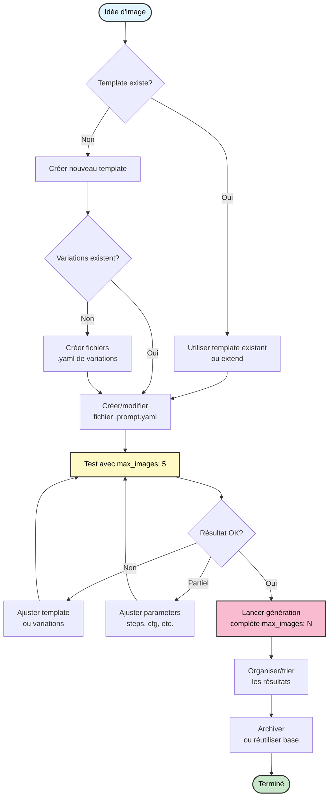

---

## Cas d'usage réels

### Cas 1 : Entraînement de LoRA

**Objectif** : Générer 500 images d'un personnage avec variations maximales

```yaml
version: '2.0'
name: 'Dataset LoRA - Character Name'

imports:
  Expression:
    - expressions.happy.yaml
    - expressions.neutral.yaml
    - expressions.sad.yaml
  Angle:
    - angles.portrait.yaml
    - angles.fullbody.yaml
  Outfit:
    - outfits.casual.yaml
    - outfits.formal.yaml
    - outfits.fantasy.yaml
  Background: backgrounds.varied.yaml

template: |
  masterpiece, 1girl, [character description],
  {Expression}, {Angle}, {Outfit}, {Background}

generation:
  mode: combinatorial
  seed_mode: progressive
  seed: 10000
  max_images: 500
```

### Cas 2 : Exploration créative

**Objectif** : Explorer rapidement des idées avec randomisation

```yaml
version: '2.0'
name: 'Creative Exploration'

imports:
  Style: styles.artistic.yaml
  Mood: moods.varied.yaml
  Color: colorpalettes.yaml

template: |
  {Style}, {Mood}, {Color} color scheme, abstract art

generation:
  mode: random
  seed_mode: random
  max_images: 100
```

### Cas 3 : Production de variantes

**Objectif** : Générer des variantes d'un concept approuvé

```yaml
version: '2.0'
name: 'Approved Concept Variants'
extends: base_approved_concept.prompt.yaml

template: |
  [concept de base déjà approuvé]
  {LightingVariation[random:10]}

generation:
  mode: combinatorial
  seed_mode: progressive
  seed: 42
  max_images: 10
```

---

## Organisation recommandée

### Structure pour un projet

```
mon-projet/
├── .sdgen_config.json          # Config globale
│
├── templates/                   # Templates réutilisables
│   ├── base_portrait.prompt.yaml
│   ├── base_landscape.prompt.yaml
│   └── base_fantasy.prompt.yaml
│
├── prompts/                     # Prompts spécifiques (extend templates)
│   ├── character_alice/
│   │   ├── alice_portrait.prompt.yaml
│   │   ├── alice_action.prompt.yaml
│   │   └── alice_expressions.prompt.yaml
│   │
│   └── scenes/
│       ├── forest_scene.prompt.yaml
│       └── city_scene.prompt.yaml
│
├── variations/                  # Variations réutilisables
│   ├── shared/                  # Variations communes
│   │   ├── expressions.yaml
│   │   ├── angles.yaml
│   │   └── backgrounds.yaml
│   │
│   ├── character_alice/         # Variations spécifiques
│   │   ├── alice_outfits.yaml
│   │   └── alice_poses.yaml
│   │
│   └── styles/
│       ├── artistic_styles.yaml
│       └── photo_styles.yaml
│
└── results/                     # Images générées
    ├── 20251006_alice_portrait/
    ├── 20251006_alice_action/
    └── 20251006_forest_scene/
```

---

## Astuces et bonnes pratiques

### 1. Commencer petit

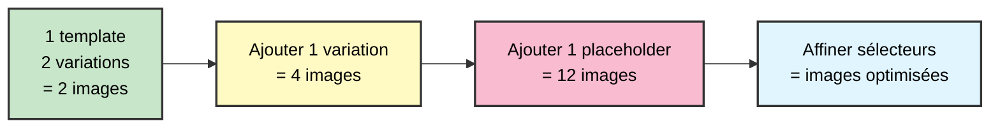

### 2. Tester avant production

```yaml
# Version test
generation:
  mode: random
  max_images: 5  # Quick test

# Version production (après validation)
generation:
  mode: combinatorial
  max_images: 500
```

### 3. Nommer clairement

```yaml
# ❌ Mauvais
name: 'test1'

# ✅ Bon
name: 'Character Alice - Portrait Expressions Test'
```

### 4. Documenter les templates

```yaml
version: '2.0'
name: 'Portrait Setup - High Quality'
description: |
  Template de base pour portraits haute qualité.

  Résolution: 832x1216 upscalée à 1248x1824
  Utilise Hires Fix avec 4x_foolhardy_Remacri

  Optimisé pour:
  - Portraits de personnages féminins
  - Style semi-réaliste
  - Lighting dramatique
```

### 5. Réutiliser avec extends

Au lieu de copier-coller, extend !

```yaml
# Nouveau prompt
extends: ../templates/base_portrait.prompt.yaml
template: |
  [juste les modifications spécifiques]
```

---

## Exemples de fichiers de variations

### expressions.yaml
```yaml
version: '1.0'
variations:
  happy: smiling, cheerful expression, bright eyes
  sad: sad expression, tears, melancholic
  angry: angry expression, frowning, intense gaze
  neutral: neutral expression, calm face
  surprised: surprised expression, wide eyes, open mouth
  thinking: thoughtful expression, hand on chin
```

### outfits.casual.yaml
```yaml
version: '1.0'
variations:
  jeans_tshirt: blue jeans, white t-shirt, casual sneakers
  hoodie: gray hoodie, black pants, comfortable shoes
  dress_casual: casual summer dress, sandals
  sportswear: athletic wear, running shoes, sporty look
```

### angles.portrait.yaml
```yaml
version: '1.0'
variations:
  front: front view, looking at camera, centered composition
  side: side profile, 90 degree angle
  three_quarter: three-quarter view, slight angle
  close_up: close-up shot, tight framing, focus on face
  upper_body: upper body shot, from chest up
```

---

## Dépannage courant

### Problème : Trop d'images générées

```yaml
# Vous avez:
Expression: 50 variations
Outfit: 30 variations
Angle: 20 variations
# = 50 × 30 × 20 = 30,000 combinaisons !

# Solution 1: Sélecteurs
template: |
  {Expression[random:5]}, {Outfit[random:3]}, {Angle[random:4]}
  # = 5 × 3 × 4 = 60 combinaisons

# Solution 2: Mode random
generation:
  mode: random
  max_images: 100
```

### Problème : Pas assez de variété

```yaml
# Au lieu de:
generation:
  seed_mode: fixed  # Toutes les images avec même seed

# Utiliser:
generation:
  seed_mode: progressive  # Seeds différentes
  # ou
  seed_mode: random
```

### Problème : Template trop répétitif

```yaml
# Au lieu de dupliquer:
# portrait1.prompt.yaml, portrait2.prompt.yaml, portrait3.prompt.yaml

# Créer une base:
# base_portrait.prompt.yaml

# Puis extend:
extends: base_portrait.prompt.yaml
template: |
  [juste ce qui change]
```

---

## Référence rapide

| Concept | Syntaxe | Exemple |
|---------|---------|---------|
| Placeholder | `{Nom}` | `{Expression}` |
| Random N | `{Nom[random:N]}` | `{Expression[random:5]}` |
| Indices | `{Nom[i,j,k]}` | `{Expression[0,2,4]}` |
| Noms | `{Nom[key1,key2]}` | `{Expression[happy,sad]}` |
| Range | `{Nom[#0-N]}` | `{Expression[#0-10]}` |
| Liste imports | Liste YAML | `HairColor:\n  - file1.yaml\n  - file2.yaml` |
| Héritage | `extends: base.yaml` | `extends: base_portrait.prompt.yaml` |
| Mode extend | `extends_mode: append` | `append / prepend / replace` |

---

## Prochaines étapes

```mermaid
graph LR
    A[Lire ce guide] --> B[Créer 1er template simple]
    B --> C[Tester avec 5 images]
    C --> D[Ajouter variations]
    D --> E[Expérimenter sélecteurs]
    E --> F[Créer template base]
    F --> G[Utiliser extends]
    G --> H[Maîtriser le système!]

    style A fill:#e1f5ff,stroke:#333,stroke-width:2px,color:#000
    style H fill:#c8e6c9,stroke:#333,stroke-width:2px,color:#000
```

1. **Créez votre premier template** avec 1-2 placeholders
2. **Testez** avec `max_images: 5`
3. **Itérez** : ajoutez des variations, affinez
4. **Créez un template de base** réutilisable
5. **Utilisez `extends`** pour éviter la duplication
6. **Explorez les sélecteurs** pour plus de contrôle

---

## Ressources

- **[Exemples de templates](../../../CLI/examples/prompts/)** - Templates prêts à l'emploi
- **[Exemples de variations](../../../CLI/examples/variations/)** - Fichiers de variations
- **[Architecture technique](../technical/phase2-templating-engine.md)** - Documentation technique détaillée

---

**Dernière mise à jour:** 2025-10-06
**Version du système:** Phase 2 avec extends + list imports
