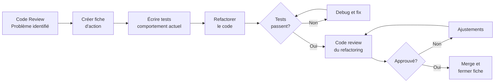
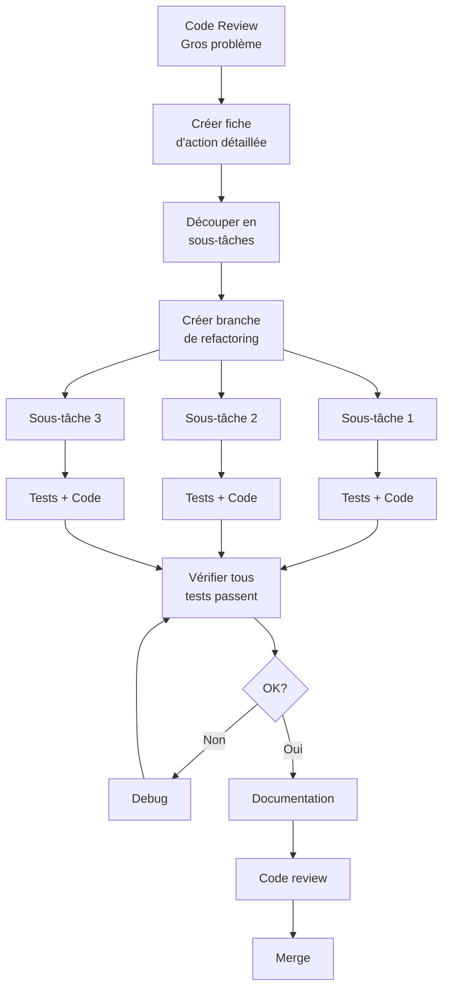

# Code Review - Templates d'Actions

**Templates et workflows pour les actions post-code review**

---

## Vue d'ensemble

Après une code review, les problèmes identifiés doivent être :
1. **Priorisés** selon leur criticité
2. **Planifiés** dans des sprints/sessions
3. **Documentés** avec des actions claires
4. **Trackés** jusqu'à résolution

Ce document fournit les templates pour chaque type d'action.

---

## Table des matières

1. [Templates de fiches d'action](#templates-de-fiches-daction)
2. [Priorisation et planning](#priorisation-et-planning)
3. [Workflows d'exécution](#workflows-dexécution)
4. [Suivi et validation](#suivi-et-validation)

---

## Templates de fiches d'action

### Template 1 : Refactoring de fonction

```markdown
# Refactor: [Nom de la fonction]

**Fichier:** `path/to/file.py`
**Fonction/Classe:** `function_name()`
**Priorité:** 🔴 Haute / 🟠 Moyenne / 🟡 Basse
**Effort estimé:** [Small: <1h / Medium: 1-4h / Large: >4h]
**Créé:** YYYY-MM-DD

## Problème actuel

**Description:**
[Décrire le problème identifié en code review]

**Code actuel:**
```python
def current_implementation():
    # Problème: trop long, complexe, etc.
    pass
```

**Impact:**
- [ ] Lisibilité
- [ ] Maintenabilité
- [ ] Performance
- [ ] Testabilité
- [ ] Sécurité

## Solution proposée

**Approche:**
[Décrire l'approche de refactoring]

**Code proposé:**
```python
def refactored_implementation():
    # Solution claire et simple
    pass
```

**Avantages:**
1. [Bénéfice 1]
2. [Bénéfice 2]

**Risques:**
- [Risque potentiel et mitigation]

## Plan d'action

- [ ] Écrire tests pour le comportement actuel
- [ ] Refactorer le code
- [ ] Vérifier que tests passent
- [ ] Mettre à jour documentation si nécessaire
- [ ] Code review du refactoring

## Tests impactés

- [ ] `test_function_name.py`
- [ ] `test_integration_xyz.py`

## Notes

[Contexte additionnel, décisions, références]

---

**Status:** 🔵 Todo / 🟡 In Progress / 🟢 Done / ⭕ Blocked
**Assigné à:** [Nom]
**Lié à:** #[issue/ticket number]
```

---

### Template 2 : Extraction de code dupliqué

```markdown
# Refactor: Éliminer duplication - [Description courte]

**Fichiers concernés:**
- `path/to/file1.py` (lignes X-Y)
- `path/to/file2.py` (lignes A-B)
- `path/to/file3.py` (lignes M-N)

**Priorité:** 🟠 Moyenne
**Effort estimé:** Medium (2-3h)
**Créé:** YYYY-MM-DD

## Duplication identifiée

**Pattern répété:**
```python
# Code répété dans 3+ endroits
with open(path, 'r', encoding='utf-8') as f:
    data = yaml.safe_load(f)
if not isinstance(data, dict):
    raise ValueError(f"Invalid format in {path}")
return data['variations']
```

**Occurrences:**
1. `file1.py:50-54` - dans `load_expressions()`
2. `file2.py:120-124` - dans `load_outfits()`
3. `file3.py:200-204` - dans `load_backgrounds()`

## Solution

**Fonction commune à créer:**
```python
def load_yaml_variations(filepath: Path) -> Dict[str, Any]:
    """
    Load variations from a YAML file.

    Args:
        filepath: Path to YAML file

    Returns:
        Dict containing variations

    Raises:
        FileNotFoundError: If file doesn't exist
        ValueError: If YAML format is invalid
    """
    with open(filepath, 'r', encoding='utf-8') as f:
        data = yaml.safe_load(f)

    if not isinstance(data, dict):
        raise ValueError(f"Invalid YAML format in {filepath}")

    return data.get('variations', {})
```

**Placement:**
- Module: `templating/loaders.py`
- Section: Utilities

## Plan d'action

- [ ] Créer fonction `load_yaml_variations()` dans `loaders.py`
- [ ] Écrire tests unitaires
- [ ] Remplacer occurrence 1 dans `file1.py`
- [ ] Remplacer occurrence 2 dans `file2.py`
- [ ] Remplacer occurrence 3 dans `file3.py`
- [ ] Vérifier tous les tests passent
- [ ] Supprimer code dupliqué

## Métriques

**Avant:**
- Lignes de code: ~15 (5 lignes × 3)
- Maintenabilité: Faible (3 endroits à modifier)

**Après:**
- Lignes de code: ~10 (fonction) + 3 (appels)
- Maintenabilité: Élevée (1 seul endroit)

**Réduction:** ~5 lignes, maintenance centralisée

---

**Status:** 🔵 Todo
```

---

### Template 3 : Découpage de grosse fonction

```markdown
# Refactor: Découper fonction longue - [Nom fonction]

**Fichier:** `path/to/file.py`
**Fonction:** `long_function_name()`
**Lignes:** 150-350 (200 lignes)
**Priorité:** 🔴 Haute
**Effort estimé:** Large (4-6h)
**Créé:** YYYY-MM-DD

## Analyse actuelle

**Longueur:** 200 lignes
**Complexité cyclomatique:** 18 (élevée)
**Responsabilités identifiées:**
1. Chargement de configuration (lignes 150-180)
2. Validation des données (lignes 181-220)
3. Transformation des données (lignes 221-270)
4. Génération de combinaisons (lignes 271-320)
5. Sauvegarde des résultats (lignes 321-350)

**Problèmes:**
- Impossible à tester unitairement
- Difficile à comprendre
- Violation SRP (Single Responsibility)

## Plan de découpage

### Fonction 1: `_load_configuration()`
```python
def _load_configuration(config_path: Path) -> Config:
    """Load and parse configuration file."""
    # Lignes 150-180 du code actuel
    pass
```

### Fonction 2: `_validate_data()`
```python
def _validate_data(data: Dict, config: Config) -> None:
    """Validate data against config schema."""
    # Lignes 181-220 du code actuel
    pass
```

### Fonction 3: `_transform_variations()`
```python
def _transform_variations(raw_data: Dict) -> List[Variation]:
    """Transform raw data into Variation objects."""
    # Lignes 221-270 du code actuel
    pass
```

### Fonction 4: `_generate_combinations()`
```python
def _generate_combinations(variations: List[Variation], mode: str) -> List[Combo]:
    """Generate combinations based on mode."""
    # Lignes 271-320 du code actuel
    pass
```

### Fonction 5: `_save_results()`
```python
def _save_results(combinations: List[Combo], output_path: Path) -> None:
    """Save results to output file."""
    # Lignes 321-350 du code actuel
    pass
```

### Fonction principale refactorée
```python
def process_variations(config_path: Path) -> None:
    """
    Process variations from config file.

    Orchestrates the entire workflow:
    1. Load configuration
    2. Validate data
    3. Transform to variations
    4. Generate combinations
    5. Save results
    """
    config = _load_configuration(config_path)
    _validate_data(config.data, config)
    variations = _transform_variations(config.data)
    combinations = _generate_combinations(variations, config.mode)
    _save_results(combinations, config.output_path)
```

## Plan d'action

### Phase 1: Préparation
- [ ] Écrire tests d'intégration pour le comportement actuel
- [ ] Documenter les cas limites et edge cases
- [ ] Créer branche de refactoring

### Phase 2: Extraction (une fonction à la fois)
- [ ] Extraire `_load_configuration()`
  - [ ] Écrire tests unitaires
  - [ ] Vérifier tests d'intégration passent
- [ ] Extraire `_validate_data()`
  - [ ] Écrire tests unitaires
  - [ ] Vérifier tests d'intégration passent
- [ ] Extraire `_transform_variations()`
  - [ ] Écrire tests unitaires
  - [ ] Vérifier tests d'intégration passent
- [ ] Extraire `_generate_combinations()`
  - [ ] Écrire tests unitaires
  - [ ] Vérifier tests d'intégration passent
- [ ] Extraire `_save_results()`
  - [ ] Écrire tests unitaires
  - [ ] Vérifier tests d'intégration passent

### Phase 3: Finalisation
- [ ] Simplifier fonction principale
- [ ] Mettre à jour documentation
- [ ] Code review
- [ ] Merge

## Métriques d'amélioration

**Avant:**
- Fonction: 200 lignes
- Complexité: 18
- Testabilité: Impossible (intégration seulement)
- Réutilisabilité: Nulle

**Après:**
- Fonctions: 6 × ~30-40 lignes
- Complexité moyenne: 3-4 par fonction
- Testabilité: Complète (unitaire + intégration)
- Réutilisabilité: Chaque fonction réutilisable

---

**Status:** 🔵 Todo
**Risque:** Moyen (fonction critique)
```

---

### Template 4 : Amélioration de la gestion d'erreurs

```markdown
# Refactor: Améliorer gestion d'erreurs - [Module/Fonction]

**Fichier:** `path/to/file.py`
**Zone:** [Fonction ou section]
**Priorité:** 🔴 Haute (si sécurité) / 🟠 Moyenne
**Effort estimé:** Small (30min - 1h)
**Créé:** YYYY-MM-DD

## Problème actuel

**Code:**
```python
def load_data(path):
    try:
        with open(path) as f:
            return json.load(f)
    except Exception:
        return None
```

**Issues:**
- [ ] Exception trop large (`Exception`)
- [ ] Erreur avalée silencieusement
- [ ] Pas de logging
- [ ] Pas de contexte pour debug
- [ ] Comportement par défaut dangereux (return None)

## Solution proposée

```python
def load_data(path: Path) -> Dict[str, Any]:
    """
    Load JSON data from file.

    Args:
        path: Path to JSON file

    Returns:
        Parsed JSON data

    Raises:
        FileNotFoundError: If file doesn't exist
        JSONDecodeError: If file contains invalid JSON
        PermissionError: If file is not readable
    """
    try:
        with open(path, 'r', encoding='utf-8') as f:
            return json.load(f)
    except FileNotFoundError as e:
        logger.error(f"Config file not found: {path}")
        raise ConfigError(f"Cannot load config from {path}: file not found") from e
    except json.JSONDecodeError as e:
        logger.error(f"Invalid JSON in {path}: {e}")
        raise ConfigError(f"Invalid JSON format in {path} at line {e.lineno}") from e
    except PermissionError as e:
        logger.error(f"Permission denied reading {path}")
        raise ConfigError(f"Cannot read {path}: permission denied") from e
```

## Améliorations

1. **Type hints** : Signature complète avec types
2. **Exceptions spécifiques** : Attraper exactement ce qu'on attend
3. **Logging** : Tracer les erreurs pour debug
4. **Context preservation** : `raise ... from e`
5. **Messages clairs** : Indiquent quoi et où
6. **Custom exception** : `ConfigError` pour la couche business

## Plan d'action

- [ ] Créer exception `ConfigError` si n'existe pas
- [ ] Ajouter logger au module
- [ ] Remplacer gestion d'erreurs actuelle
- [ ] Écrire tests pour chaque cas d'erreur
- [ ] Mettre à jour documentation

## Tests à ajouter

```python
def test_load_data_file_not_found():
    with pytest.raises(ConfigError, match="file not found"):
        load_data(Path("nonexistent.json"))

def test_load_data_invalid_json():
    # Create file with invalid JSON
    with pytest.raises(ConfigError, match="Invalid JSON"):
        load_data(invalid_json_path)

def test_load_data_permission_denied():
    # Create file without read permissions
    with pytest.raises(ConfigError, match="permission denied"):
        load_data(protected_path)
```

---

**Status:** 🔵 Todo
```

---

### Template 5 : Suppression de code mort

```markdown
# Cleanup: Supprimer code mort - [Description]

**Fichiers concernés:**
- `file1.py`
- `file2.py`

**Priorité:** 🟡 Basse
**Effort estimé:** Small (15-30min)
**Créé:** YYYY-MM-DD

## Code identifié comme mort

### Fonction non utilisée
**Fichier:** `utils.py`
**Fonction:** `legacy_converter()`
**Lignes:** 150-180

**Preuve d'inutilisation:**
- Aucun import de cette fonction dans la codebase
- Grep search: 0 résultats
- Dernière modification: 6 mois (commit abc123)

**Raison historique:**
Utilisé dans l'ancien système (Phase 0), remplacé par `new_converter()` en Phase 1.

### Variables non utilisées
**Fichier:** `config.py`
**Variables:**
- `LEGACY_MODE` (ligne 42) - Jamais lue
- `OLD_API_URL` (ligne 45) - Jamais lue

### Imports inutiles
**Fichier:** `loaders.py`
```python
import deprecated_module  # Ligne 8 - jamais utilisé
from old_utils import old_func  # Ligne 12 - jamais utilisé
```

## Plan d'action

- [ ] Vérifier dans l'historique git pourquoi ces éléments existaient
- [ ] Confirmer avec team qu'ils ne sont plus nécessaires
- [ ] Supprimer fonction `legacy_converter()`
- [ ] Supprimer variables `LEGACY_MODE`, `OLD_API_URL`
- [ ] Supprimer imports inutiles
- [ ] Vérifier que tests passent
- [ ] Mettre à jour CHANGELOG si nécessaire

## Vérifications

```bash
# Vérifier qu'aucune référence existe
grep -r "legacy_converter" .
grep -r "LEGACY_MODE" .
grep -r "OLD_API_URL" .
grep -r "deprecated_module" .
```

## Métriques

**Lignes supprimées:** ~50
**Imports nettoyés:** 2
**Maintenance réduite:** Moins de code à maintenir

---

**Status:** 🔵 Todo
```

---

### Template 6 : Ajout de documentation

```markdown
# Documentation: [Module/Fonction]

**Fichier:** `path/to/file.py`
**Zone:** [Classe/Fonction/Module]
**Priorité:** 🟠 Moyenne
**Effort estimé:** Small (30min - 1h)
**Créé:** YYYY-MM-DD

## État actuel

**Code sans doc:**
```python
def process_variations(data, mode, limit):
    if mode == 'random':
        return random.sample(data, limit)
    else:
        return list(itertools.product(*data.values()))[:limit]
```

**Problèmes:**
- Pas de docstring
- Pas de type hints
- Args non documentés
- Comportement non clair

## Documentation à ajouter

```python
def process_variations(
    data: Dict[str, List[Variation]],
    mode: str,
    limit: Optional[int] = None
) -> List[Dict[str, Variation]]:
    """
    Generate variations based on specified mode.

    Creates either random unique combinations or exhaustive combinatorial
    products from the provided variation data.

    Args:
        data: Dictionary mapping placeholder names to lists of variations.
              Example: {"Expression": [var1, var2], "Angle": [var3, var4]}
        mode: Generation mode. Either 'random' for random sampling or
              'combinatorial' for all possible combinations.
        limit: Maximum number of variations to generate. If None, generates
               all combinations in combinatorial mode or raises ValueError
               in random mode.

    Returns:
        List of variation dictionaries. Each dict maps placeholder names
        to selected variations.
        Example: [{"Expression": var1, "Angle": var3}, ...]

    Raises:
        ValueError: If mode is 'random' and limit is None
        ValueError: If mode is not 'random' or 'combinatorial'

    Example:
        >>> data = {"Mood": [happy, sad], "Style": [anime, realistic]}
        >>> combinations = process_variations(data, 'combinatorial', limit=10)
        >>> len(combinations)
        4  # 2 moods × 2 styles
    """
    if mode == 'random':
        if limit is None:
            raise ValueError("limit is required for random mode")
        # Flatten all variations
        all_variations = list(data.values())
        return random.sample(list(itertools.product(*all_variations)), limit)
    elif mode == 'combinatorial':
        combinations = list(itertools.product(*data.values()))
        return combinations[:limit] if limit else combinations
    else:
        raise ValueError(f"Invalid mode: {mode}. Expected 'random' or 'combinatorial'")
```

## Éléments ajoutés

- [x] Docstring complète (Google style)
- [x] Type hints pour tous les paramètres
- [x] Description des Args avec types et exemples
- [x] Description du Returns avec format
- [x] Liste des Raises possibles
- [x] Exemple d'utilisation concret
- [x] Amélioration du code (validation, messages d'erreur)

## Plan d'action

- [ ] Ajouter docstring et type hints
- [ ] Améliorer validation et messages d'erreur
- [ ] Ajouter tests pour les edge cases documentés
- [ ] Vérifier avec mypy (type checking)

---

**Status:** 🔵 Todo
```

---

## Priorisation et planning

### Matrice de priorisation

| Criticité | Effort Small | Effort Medium | Effort Large |
|-----------|--------------|---------------|--------------|
| 🔴 Haute  | **P1** - Faire immédiatement | **P2** - Cette semaine | **P3** - Ce sprint |
| 🟠 Moyenne | **P2** - Cette semaine | **P3** - Ce sprint | **P4** - Prochain sprint |
| 🟡 Basse  | **P3** - Ce sprint | **P4** - Prochain sprint | **P5** - Backlog |

### Sprint planning template

```markdown
# Sprint Refactoring - [Nom du sprint]

**Dates:** YYYY-MM-DD à YYYY-MM-DD
**Objectif:** [Objectif principal du sprint]

## Actions planifiées

### P1 - Critique (à faire en premier)
- [ ] [Action 1] - Estimation: 2h - Assigné: [Nom]
- [ ] [Action 2] - Estimation: 1h - Assigné: [Nom]

### P2 - Haute priorité
- [ ] [Action 3] - Estimation: 4h - Assigné: [Nom]
- [ ] [Action 4] - Estimation: 3h - Assigné: [Nom]

### P3 - Moyenne priorité (si temps)
- [ ] [Action 5] - Estimation: 2h - Assigné: [Nom]

### P4 - Reporté au prochain sprint
- [ ] [Action 6] - Raison: Manque de temps
- [ ] [Action 7] - Raison: Dépend de l'action 3

## Capacité

**Temps disponible:** 16h
**Temps planifié (P1+P2):** 10h
**Buffer:** 6h (37.5%)

## Risques

- [Risque 1 et mitigation]
- [Risque 2 et mitigation]
```

---

## Workflows d'exécution

### Workflow 1 : Refactoring simple



### Workflow 2 : Refactoring complexe



---

## Suivi et validation

### Dashboard de suivi

```markdown
# Refactoring Dashboard - [Module/Component]

**Dernière mise à jour:** YYYY-MM-DD

## Métriques globales

| Métrique | Avant | Après | Amélioration |
|----------|-------|-------|--------------|
| Lignes de code | 5,000 | 4,200 | -16% |
| Complexité moyenne | 8.5 | 4.2 | -50% |
| Couverture tests | 45% | 78% | +73% |
| Fonctions > 50 lignes | 23 | 5 | -78% |
| Code dupliqué | 18% | 3% | -83% |

## Actions par statut

### 🟢 Done (12)
- [x] Refactor: `resolve_prompt()` découpage
- [x] Cleanup: Supprimer `legacy_loader.py`
- [x] Doc: Ajouter docstrings à `selectors.py`
- ... (9 autres)

### 🟡 In Progress (3)
- [ ] Refactor: Extraction duplication dans `loaders.py` (75%)
- [ ] Tests: Ajouter tests pour `multi_field.py` (40%)
- [ ] Doc: Guide utilisateur `chunk_system.md` (20%)

### 🔵 Todo (8)
- [ ] Refactor: Simplifier `_generate_random_mixed()`
- [ ] Cleanup: Supprimer variables mortes dans `config.py`
- ... (6 autres)

### ⭕ Blocked (1)
- [ ] Refactor: `chunk.py` - Attend décision architecture

## Prochaines actions (cette semaine)

1. **Finir extraction duplication** (`loaders.py`)
2. **Commencer refactor** `_generate_random_mixed()`
3. **Débloquer** décision architecture pour `chunk.py`

## Burndown

```
Actions totales: 24
✅ Done:    12 (50%)
🔄 WIP:      3 (12.5%)
📋 Todo:     8 (33.3%)
🚫 Blocked:  1 (4.2%)
```

**Vélocité:** 4 actions/semaine
**Estimation fin:** 3 semaines
```

### Checklist de validation d'une action

```markdown
## Checklist de validation - [Action ID]

### Code
- [ ] Code refactoré et lisible
- [ ] Pas de duplication introduite
- [ ] Respect des standards du projet
- [ ] Type hints ajoutés/corrects
- [ ] Pas de warnings du linter

### Tests
- [ ] Tests existants passent tous
- [ ] Nouveaux tests ajoutés si nécessaire
- [ ] Coverage maintenu ou amélioré
- [ ] Tests des edge cases

### Documentation
- [ ] Docstrings à jour
- [ ] README mis à jour si nécessaire
- [ ] CHANGELOG mis à jour
- [ ] Commentaires pertinents ajoutés

### Review
- [ ] Auto-review faite
- [ ] Code review par pair effectuée
- [ ] Commentaires de review addressés
- [ ] Approuvé par reviewer

### Déploiement
- [ ] Branche mergée
- [ ] Fiche d'action fermée
- [ ] Metrics mises à jour
- [ ] Team notifiée si breaking change

---

**Validé par:** [Nom]
**Date:** YYYY-MM-DD
```

---

## Outils de tracking

### GitHub Issues template

```markdown
---
name: Refactoring Action
about: Template for refactoring actions from code review
title: '[REFACTOR] '
labels: refactoring, code-quality
assignees: ''
---

## Contexte
Issue identifié lors de la code review de [fichier/module].

## Problème
[Description du problème]

**Code actuel:**
```python
# Code problématique
```

## Solution proposée
[Description de la solution]

**Code proposé:**
```python
# Code refactoré
```

## Checklist
- [ ] Tests écrits pour comportement actuel
- [ ] Code refactoré
- [ ] Tests passent
- [ ] Documentation mise à jour
- [ ] Code review

## Liens
- Code review: #[PR number]
- Fiche d'action: [lien vers .md]

## Estimation
- Effort: Small / Medium / Large
- Temps: [X]h

## Priorité
🔴 Haute / 🟠 Moyenne / 🟡 Basse
```

---

## Exemples de workflows complets

### Exemple 1 : Petite amélioration (Small effort)

**Jour 1 - Matin (30 min)**
1. Créer fiche d'action depuis code review
2. Créer branche `refactor/improve-error-handling`
3. Écrire tests du comportement actuel
4. Implémenter amélioration
5. Vérifier tests passent
6. Commit + push

**Jour 1 - Après-midi (30 min)**
7. Ouvrir PR avec référence à la fiche
8. Auto-review
9. Demander code review
10. Addresser commentaires si besoin
11. Merge
12. Fermer fiche d'action

**Total: 1h**

### Exemple 2 : Refactoring moyen (Medium effort)

**Semaine 1 - Jour 1 (2h)**
1. Créer fiche d'action détaillée
2. Découper en sous-tâches
3. Créer branche `refactor/extract-duplicated-code`
4. Écrire tests pour code existant

**Semaine 1 - Jour 2 (2h)**
5. Créer fonction commune
6. Tests unitaires de la fonction
7. Remplacer première occurrence

**Semaine 1 - Jour 3 (2h)**
8. Remplacer autres occurrences
9. Vérifier tous tests passent
10. Documentation

**Semaine 1 - Jour 4 (1h)**
11. Code review
12. Ajustements
13. Merge et fermer fiche

**Total: 7h sur 4 jours**

### Exemple 3 : Gros refactoring (Large effort)

**Sprint 1 - Semaine 1**
- Analyse et planification
- Création de sous-fiches
- Tests d'intégration du comportement actuel

**Sprint 1 - Semaine 2**
- Extraction fonction 1 + tests
- Extraction fonction 2 + tests
- Review intermédiaire

**Sprint 2 - Semaine 1**
- Extraction fonctions 3-5 + tests
- Refactor fonction principale
- Documentation

**Sprint 2 - Semaine 2**
- Tests d'intégration finaux
- Code review complète
- Ajustements et merge

**Total: 4 semaines, ~20-30h**

---

## Templates de communication

### Template d'email : Refactoring terminé

```
Subject: [DONE] Refactoring: [Description courte]

Bonjour,

Le refactoring de [module/fonction] est terminé et mergé.

**Changements:**
- [Changement 1]
- [Changement 2]

**Améliorations:**
- Complexité réduite de X à Y
- [Autre amélioration quantifiable]

**Tests:**
✅ Tous les tests passent
✅ Coverage: +X%

**Breaking changes:**
[None / Liste des breaking changes]

**Documentation:**
- Fiche d'action: [lien]
- PR: #[number]
- Commits: [hash1], [hash2]

**Prochaines étapes:**
[Si applicable]

Merci,
[Nom]
```

---

## Références

- [Code Review Guidelines](./CODE_REVIEW_GUIDELINES.md)
- [Refactoring Catalog - Martin Fowler](https://refactoring.com/catalog/)
- [Git Best Practices](https://github.com/git-tips/tips)

---

**Version:** 1.0
**Dernière mise à jour:** 2025-10-06
